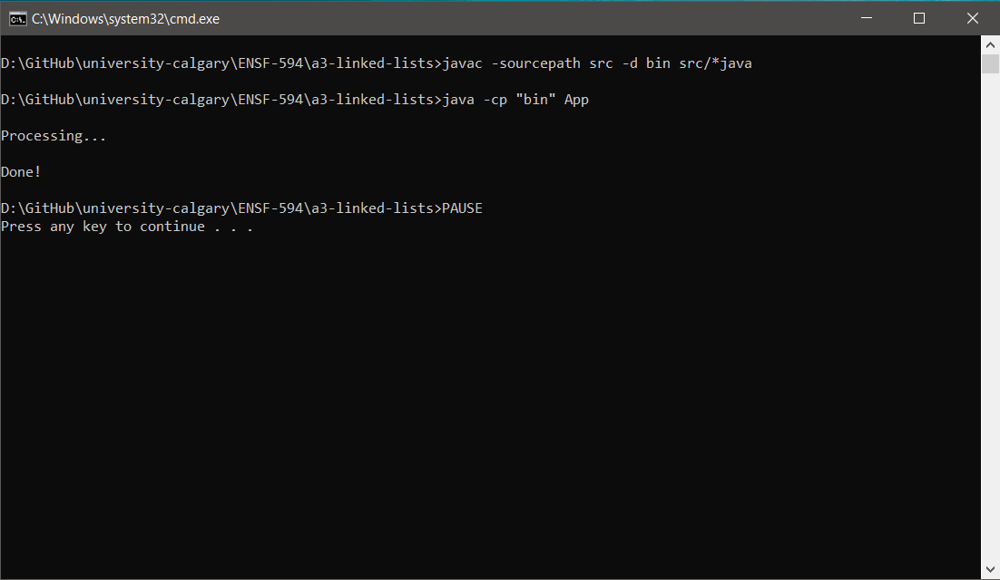

# ENSF-594 Assignment 3

Assignment on a linked lists to solve the problem given in the file [Questions.pdf](Questions.pdf).

## How to build and run

1. Clone the repository to your local machine.

2. Run the script [`launch.sh`](launch.sh) or [`launch.cmd`](launch.cmd) to launch the program.

3. Then follow the onscreen instructions.

## How it works

1. User launches the program

2. The program reads the [`input.txt`](input.txt) file

3. The program displays <b>Processing...</b> while it processes the input

4. The program writes the processed output in the file [`output.txt`](output.txt)

5. The program exits with the message <b>Done!</b>

## Execution Screenshots

